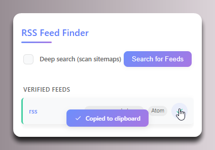

  

# RSS Feed Finder

  

A browser extension that detects and validates RSS/Atom feeds on websites. This extension helps you discover valid feed URLs that might not be obvious or properly advertised on the websites you visit.

## Features

- **Advanced Feed Detection**: Multiple methods to find both obvious and hidden feeds
- **Smart Validation**: Only displays working RSS/Atom feeds, filtering out invalid or inaccessible URLs
- **Deep Search Option (In-Progress)**: Scans sitemaps to discover additional feeds
- **Modern, Minimal UI**: Clean interface with gradient styling for excellent usability
- **Enhanced Copy Feature**: One-click copying with visual confirmation
- **Lightweight Implementation**: Fast performance with minimal resource usage

## Installation Instructions

This extension needs to be installed in developer mode as an unpacked extension. Follow these steps:

### For Chrome

1. Download or clone this repository to your local machine
2. Open Chrome and navigate to `chrome://extensions/`
3. Enable "Developer mode" by toggling the switch in the top-right corner
4. Click the "Load unpacked" button that appears
5. Browse to the folder where you downloaded/cloned this extension and select it
6. The RSS Feed Finder extension should now appear in your extensions list and be ready to use

### For Brave

1. Download or clone this repository to your local machine
2. Open Brave and navigate to `brave://extensions/`
3. Enable "Developer mode" by toggling the switch in the top-right corner
4. Click the "Load unpacked" button that appears
5. Browse to the folder where you downloaded/cloned this extension and select it
6. The RSS Feed Finder extension should now appear in your extensions list and be ready to use

### For Edge

1. Download or clone this repository to your local machine
2. Open Edge and navigate to `edge://extensions/`
3. Enable "Developer mode" by toggling the switch in the left sidebar
4. Click the "Load unpacked" button that appears
5. Browse to the folder where you downloaded/cloned this extension and select it
6. The RSS Feed Finder extension should now appear in your extensions list and be ready to use

## How to Use

1. Visit a website that you want to check for RSS/Atom feeds
2. Click on the RSS Feed Finder extension icon in your browser toolbar
3. Click the "Search for Feeds" button to scan the current page
4. For more thorough searching, enable the "Deep search" option to scan sitemaps
5. Only valid, working RSS/Atom feeds will be displayed in the results
6. Click the copy icon next to any feed to copy its URL to your clipboard
7. A notification will confirm when the URL has been copied
8. Use the copied URL in your favorite RSS reader application

## Troubleshooting

- If no feeds are found on a page that you know has feeds, try enabling the "Deep search" option
- Some websites may hide their feeds or make them difficult to detect
- The extension filters out invalid and inaccessible feeds, so only working feeds will be shown
- If the extension stops working, try reinstalling it following the installation steps

## Privacy

This extension only runs when you click its icon and does not track your browsing activity. It only accesses the current tab's content to find feed URLs.

## License

This project is open source and available under the [MIT License](LICENSE).
